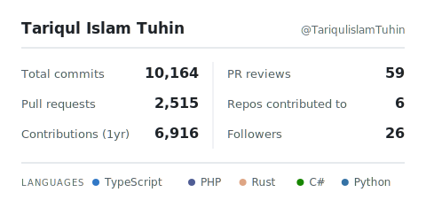

# Tariqul Islam Tuhin

 

---

## What I Build

**Enterprise ERP & fintech** — multi-tenant SaaS platforms with double-entry accounting
engines, payroll, and POS, wired to bank and payment integrations. I lead the finance
core end to end, from schema to API.

**Commerce at scale** — multi-vendor marketplaces and headless storefronts with
real-time inventory, vendor dashboards, and GraphQL/REST APIs.
Live demos: [PickBazar](https://pickbazar.redq.io) · [Pixer](https://pixer.redq.io) · [Chawkbazar](https://chawkbazar.redq.io)

> Full case studies and experience → **[Résumé](https://tariqul-islam-tuhin-cv.vercel.app/)**

---

## Open Source

**Next.js — [Turbopack fix #95242](https://github.com/vercel/next.js/pull/95242)** &nbsp;`merged`
Removed duplicate `filename`/`exportedName` fields from the server-reference-manifest,
shrinking bloated build output (170MB+) on large App Router apps.

---

## Stack

| | |
|---|---|
| **Languages** | `TypeScript` · `JavaScript` · `PHP` · `SQL` |
| **Backend** | `Node.js` · `NestJS` · `Express` · `Laravel` · `GraphQL` |
| **Frontend** | `Next.js` · `React` · `TailwindCSS` · `shadcn/ui` |
| **Data** | `PostgreSQL` · `MySQL` · `Redis` |
| **Infra** | `Docker` · `Kafka` · `RabbitMQ` |

---

